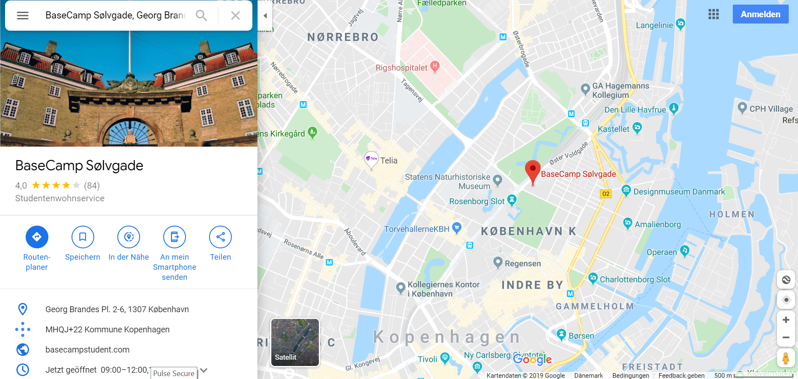

# **Basecamp**

A good place of living to start with is the well-known student dorm, called Basecamp. It is situated very centered to Kings Garden and Slot Rosenborg and is only 7 bike-minutes away from the Maersk Tower and the university campus. It is surrounded by several supermarkets and for the running-fans of you it is also a nice place from which you can start your route towards Kastellet, a very nice park area and the harbor where you can run along the way where cruising ships enter. You will reach “The End”, a very nice spot, where you can get some refreshments and enjoy the wonderful view to the sea. Sometimes you can also see a water airplane landing. 

Before you come to Copenhagen you can sign up for a room in Basecamp. The nicest rooms are maybe those with the view to Kings Garden. So when you are lucky you might get one of these. Rooms facing the courtyard can be quiet noisy especially on weekends when people like to party. There are rooms available with different sizes. You can choose between shared rooms, single rooms and rooms for couples. The prize range is between 6.000 and 10.000 DKK. Rooms include a small kitchen, a bathroom with a toilet and a shower as well as bed, table, desk, cupboard and several utensils for cooking. 

In the basement you can find washing machines and driers, which work by a pre-pay system. You will obtain a chip where you can book money on and use it for washing. The prizes for washing are 20-25 DKK per wash and 0,40 DKK/min of drying your laundry. Normally the washing machines and driers are never fully booked out and you will always find machines available. 
Sport fans will find three fitness rooms in the basement with various equipment, for instance a rowing machine, steppers, treadmills and barbells.
Furthermore there are common kitchens and a lounge where you can cook and sit together and enjoy your time. Every month there are announcements of movie nights and people will gather in the cinema room where they watch movies projected on a big wall. 

All in all Basecamp is a good choice for living during your initial time in Copenhagen. Many from your program might sign up to live there which is a nice thing and a good opportunity to connect in the beginning, to organize leisure activities, to hang out and cook together. However there are also other possibilities and you can also choose another student dorm beside of Basecamp that is organized by UCPH housing foundation. There are also flats available by UCPH housing, which are not like student dorms at all but situated in normal apartment buildings.

Many students decide to look for a flat after spending some months in Basecamp. It is then up to you, what you prefer for long term, however Basecamp is a good start, where everything you need is organized, as you will have a lot of organisatorial stuff to accomplish in the beginning beside of taking care of your housing!
