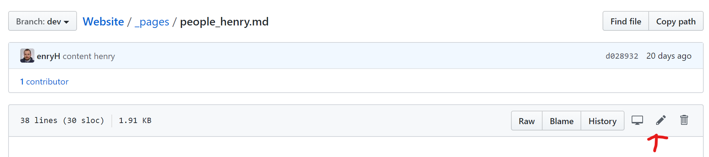
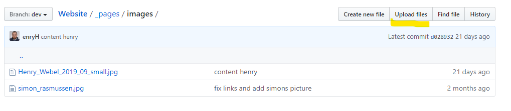

<!-- Github explanations -->
# Copenhagen Bioscience PhD Programme 

Providing information for starting as a new PhD student from abroad in Copenhagen 
in the [Copenhagen Bioscience PhD Programme](https://cphbiosciencephd.org/) (CBPP).
 Createad as a training resource for learning git and collaborating using github.

> Please create an [issue](https://github.com/enryH/cbpp_info/issues) if you have suggestions 
> on further content or for general changes.

## Learning Goals

- Create a [website](https://enryh.github.io/cbpp_info/) using [GitHub Pages](https://pages.github.com/)
- Render Text using [Markdown](https://guides.github.com/features/mastering-markdown/)
- Basic knowledge of [git](https://git-scm.com/) functionality
- Collaborating in an open source environment as described in [_A successful Git branching model_](https://nvie.com/posts/a-successful-git-branching-model/)

> No Coding involved. Only Text

## Provided Information 
- [lifex website](https://www.joinlifex.com/copenhagen/moving-to-copenhagen-denmark) on how to get started in Copenhagen
  - put into perspective what you have to do
  - give a priority of different options
- Housing ([Basecamp](_pages/basecamp.md), Housing Foundation, [Private Housing](_pages/housing_no_basecamp.md))
- Arriving as [Nordic citizen](_pages/register_nordic.md), [EU citizen](_pages/register_EU_citizen.md) and [Non-EU citizen](_pages/register_non_EU_citizen.md)
- ISM vs Borgerservice
- [banks](_pages/banks.md)
- [transportation](_pages/transportation.md), including [bikes](_pages/bikes.md)
- [furniture](_pages/furniture.md)


## Editing Hints
You can either edit online or offline using [Markdown](https://guides.github.com/features/mastering-markdown/).
### Edit online an existing file on GitHub 
Without any prior setup on your local site, you can edit files directly on github, see the arrow on the screenshot below for 
[_pages/enryh](https://github.com/RasmussenLab/Website/blob/dev/_pages/people_henry.md):



Once you click on it, you are able to edit and preview your changes. Saving is equal to making a commit.

If you want, you can also upload a picture to 
[_pages/image/your_name.png](https://github.com/RasmussenLab/Website/tree/dev/_pages/images) 
of yours and reference it in your page:



> you commit your changes to the branch you selected!

### Local file editing
- Follow the description in [setup.md](setup.md)
- Please create your own branch and then submit your changes using an pull request to the `dev`-branch

## Develop Website locally

Follow the instructions to install [**jekyll**](https://jekyllrb.com/docs/installation/#requirements) locally. 
Then you can develop your pages on the fly using. However, most editors have a markdown preview function,
which is more than enough to develop your personal site.

```
bundle exec jekyll serve --watch
```

> Website is deployed using [GitHub Pages](https://pages.github.com/)


## Resources

### Minimal
- [Minimal](https://github.com/pages-themes/minimal) Github Theme
- Karl Bromans Tutorial on creating a [simple site](https://github.com/kbroman/simple_site)

### Minimal Mistakes
- [Minimal Mistakes](https://mmistakes.github.io/minimal-mistakes/) Theme 

