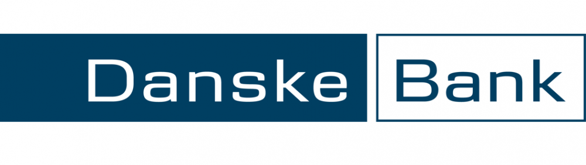

# Banking

In order to get paid, which is very important here in Denmark, you need a Danish bank account. Here are some of the available options we tried and some general things to keep in mind.

## Important: Nem-ID!

There are two ways to get your Nem-ID **(Link this to the Nem-ID article)** once you've got your CPR number:
- Through the citizen service ([Borger Service](https://www.nemid.nu/dk-en/get_started/request_nemid/))
- Through your bank

Both of these options are fine as long as you **don't start both processes at the same time**. 

> Seriously, don't start both processes at the same time.

What you end up doing is up to you. The Borger Service process is usually faster and once you've got your Nem-ID activated online you can go to the bank with your signed documents.
The bank option takes care of both banking and Nem-ID at the same time but usually takes a bit longer. Once you bring them your signed documents, the will take care of getting you your Nem-ID and will send you the keycard. This is fine if you apply for a bank account as soon as you've got your CPR number.

## Banks

### Danske Bank

One option is opening an account for non-Danish citizens at [Danske Bank](https://danskebank.dk/en/personal/become-a-customer). 

- Proof of identity (e.g. passport)
- Rental contract
- Signed letter of employment
- CPR-number document **Link this to the CPR number article**
- Selfie with the queen (*optional*)

> You don't actually need a selfie with the queen.

#### Issues we came accross
- Submitting the bank contract before Nem-ID was activated online caused Danske Bank to cancel the running Nem-ID process and made them start a new one. This delayed everything for two weeks
- Sometimes they "forget" to process registrations; if you don't get any reply for a week, contact them!