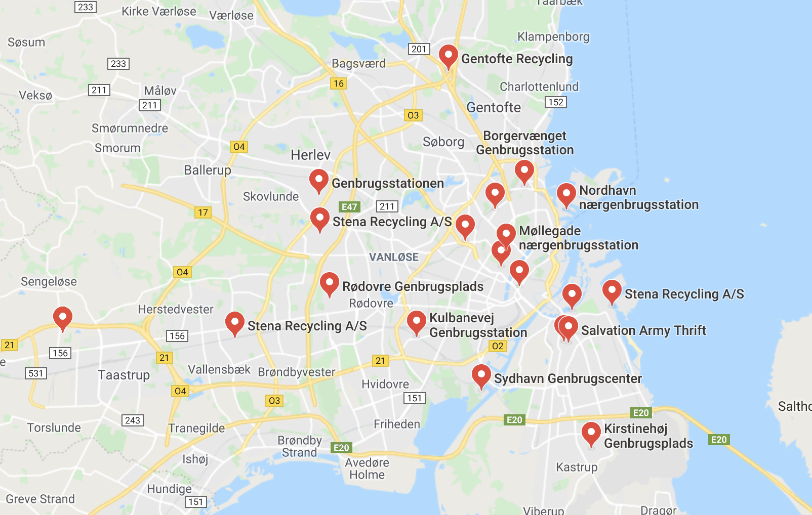

# How furnish your new home?
Moving into an unfurnished flat can be a bit tedious, as you need to buy all the furniture on your own. We all know IKEA is a good choice for finding nice and cheap furniture, however, there are other possibilities and you will save a lot of money!

## IKEA 
There are two IKEA shops in Copenhagen (Gentofte and Taastrup). Both shops can be reached either by bus or train, but take this into account if you need to transport big furniture to your new place. IKEA works with a transport company that will take all your newly acquired stuff to your home for **300DKK**. You can ask for this service when you pay and the cashier will inform you about how to do it. 

>CHEAP TIP:
IKEA offers products for a **reduced price**, this area is usually located in the warehouse, close to the cashes. Have a look if you are looking for a mattress, blankets, curtains... it can be a great bargain!

## JYSK

Jysk is a Danish shop for home furniture. Although is more expensive than IKEA with some of the items, they usually release good offers every month (i.e. a new dinning table with 4 chairs - fancy looking - for 2000 DKK). 

Maybe it is not the first option to check, but the offers are very worth considering. 

## RECYCLING STATIONS

Danes are very keen on reusing old furniture, kitchen stuff and many other things. Recycling stations are located around the city and they are a very good option to get things **(for free!)**. You will find a lot of kitchen equipment (plates, glasses and other utensils), chairs and bigger furniture (sofas, carpets) and even home appliances like blenders or hoovers. 

Many of the things here can look damaged or broken, but there are many other that are in a very good condition and could be perfectly taken to your new home. 

>TIP: Saturday and Sunday mornings are good days to check these places! A lot of people take their unwanted stuff on the weekends. 

But... remember that as everything is for free, first come first served. 

To check the closest recycling place to your home, just google "recycling place copenhagen" and you will find something like the image above. Then just choose the closest one and check!

## SECOND HAND SHOPS

Second hand shops are common in Copenhagen, not only for clothes but also for home stuff. Have a look to these places as you could find useful things for home for a considerably reduced price. 

## SECOND HAND STUFF ON THE INTERNET 

The internet is a very nice place to look for second hand things, and checking is very easy as you can just look for what you want from your phone. 

Check Facebook groups like **FREE YOUR STUFF COPENHAGEN** where people give away a lot of things. Even though some people try to sell them, most of them are FOR FREE! People just want to get rid of these things asap. To get them, you will just have to write a comment on the post or directly contact the advertiser, but be quick as things go fast!

You can also download the **DBA** app. It is a second hand app for Danish people where people sell or give away their stuff. Unfortunately, the app is only in danish, so you may want to learn a bit before using it!

