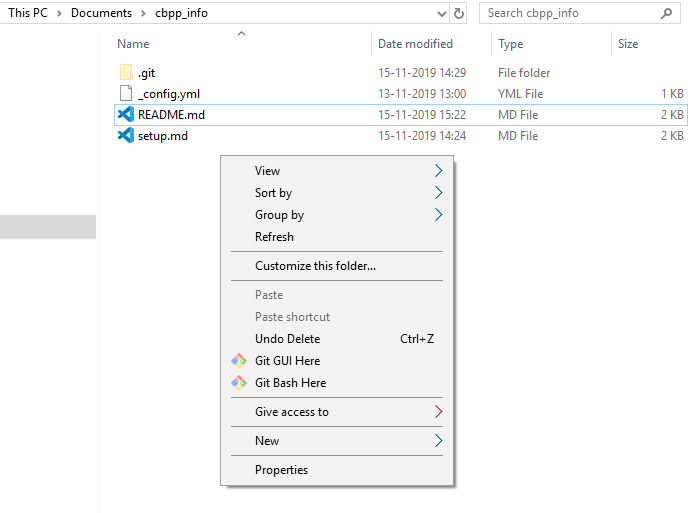

## Henry's setup

### Editor
- [VSCode](https://code.visualstudio.com/) - it nicely previous MarkDown files and is relativly light-weight.
- Alternatives: [Sublime](https://www.sublimetext.com/), [Atom](https://atom.io/), [Notepad++](https://notepad-plus-plus.org/), PyCharm, RStudio

## git
- Command line tool for distributed version control

### Setup 
- Download [git](https://git-scm.com/) and install
- Create a [github account](https://github.com/), you can even get free professional account using [github education](https://education.github.com/)

### Getting your local copy of files (alias repository)
Launch a terminal (alias command line) in the folder where you want to copy files to after installing git:

- Windows: After installing git, right-click in a folder will have `git bash here`

- MAC-OS: Launch an terminal in folder using `New Terminal in Folder` according to this [blog-post](https://lifehacker.com/launch-an-os-x-terminal-window-from-a-specific-folder-1466745514). Maybe there is also a `git-bash here` option in the context menu?!

> Alternative: use `pwd` (present working directory) and `cd` (change directory) to navigate to your destination folder.

Once you have your terminal open clone the repository using 

```bash
git clone https://github.com/enryH/cbpp_info.git # copy files from remote server hosted by github
cd cbpp_info # got into just created folder
```
which will promt something like ("$" denotes a input by a user)
```bash
$ git clone https://github.com/enryH/cbpp_info.git
Cloning into 'cbpp_info'...
remote: Enumerating objects: 16, done.
remote: Counting objects: 100% (16/16), done.
remote: Compressing objects: 100% (11/11), done.
remote: Total 16 (delta 3), reused 13 (delta 3), pack-reused 0
Unpacking objects: 100% (16/16), done.

$ cd cbpp_info/

$ git status
On branch bikes
nothing to commit, working tree clean

```

Navigate to your newly creating folder using your file browser and open files in VS Code. You can [preview markdown]() files in VS Code, i.e. have them rendered as on github.


> Use `tab` for autocompleting file-names.

### Creating your own branch
In the best case you create your own branch to prepare changes which then will be pulled back into the main or development branch.

```bash
git branch mygroupbranch # create new branch
git checkout mygroupbranch # change filesystem to new branch
```

Then you are on your own branch on your local device, which you then can synchronize with the repository

### Commiting code to a branch
Commit your code from your local branch. See using `git status` and `git diff` where you are, what changed and decide what you want to commit:

```bash
git status # which branch are you on? which files are staged?
git diff   # see differences between current and previous version of files
```

Then add file one by one to the stagging area.

```bash
git add file1 
git add file2 file3 file4 
```

Check again using `git status` if you added all you wanted. Then commit 

```bash
git commit -m "my commit message" # the message can be anything
git push  # will promt several thing if branch does not exist on github remote server
```
